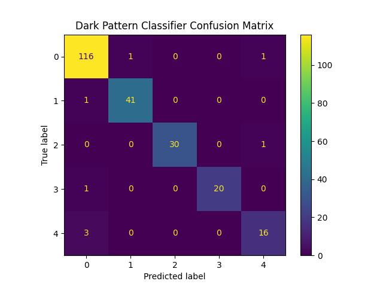

# Dark Pattern Scanner

A machine learning-powered Chrome extension that detects potential dark patterns on e-commerce websites in real time using a fine-tuned BERT model and a FastAPI backend.

## Overview

Dark patterns are deceptive design techniques used to manipulate users into making decisions they may not otherwise make. This project uses Natural Language Processing (NLP) and Machine Learning to identify potentially manipulative text such as urgency messages, scarcity tactics, and misleading prompts on websites.

The system consists of:

1. Chrome Extension for webpage scanning
2. FastAPI backend for model inference
3. Fine-tuned BERT classifier
4. Evaluation and visualization tools


## Features

1. Real-time webpage scanning
2. Dark pattern detection using BERT
3. Chrome Extension integration
4. FastAPI REST API
5. Confidence-based prediction filtering
6. Model evaluation and performance analysis


## Demo

### Dark Pattern Detection

Detected dark pattern highlighted in real-time by the Chrome extension.


### Extension Interface

Chrome extension popup showing scanning and detection results.


## Model Performance

 Metric    | Score  
           |
 Accuracy  | 96.54% 
 Precision | 96.54% 
 Recall    | 96.54% 
 F1 Score  | 96.52% 

### Confusion Matrix




## Tech Stack

### Machine Learning

1. Python
2. PyTorch
3. Hugging Face Transformers
4. BERT
5. Scikit-learn

### Backend

1. FastAPI
2. Uvicorn

### Frontend

1. JavaScript
2. Chrome Extension API
3. HTML
4. CSS

### Data Processing

1. Pandas
2. NumPy


## Project Structure

```text
DarkPatternScanner/
│
├── extension/
│   ├── manifest.json
│   ├── content.js
│   ├── popup.html
│   └── popup.js
│
├── src/
│   ├── preprocess.py
│   ├── train.py
│   ├── evaluate.py
│   ├── predict.py
│   └── config.py
│
├── data/
│   ├── raw/
│   └── processed/
│
├── app/
├── screenshots/
├── api.py
├── confusion_matrix.png
├── requirements.txt
└── README.md
```

## Installation

### Clone Repository

```bash
git clone https://github.com/ojaswita06/Dark-Pattern-Scanner.git
cd Dark-Pattern-Scanner
```

### Install Dependencies

```bash
pip install -r requirements.txt
```

### Run Backend

```bash
uvicorn api:app --reload
```

Backend will start at:

```text
http://127.0.0.1:8000
```

## Load Chrome Extension

1. Open Chrome
2. Navigate to `chrome://extensions`
3. Enable Developer Mode
4. Click **Load Unpacked**
5. Select the `extension` folder
6. Open a supported website and start scanning

## Future Improvements

1. Context-aware dark pattern detection
2. Explainable AI predictions
3. Severity scoring system
4. Support for additional websites
5. Improved dataset and fine-tuning
6. Real-time browser notifications

## Results

The fine-tuned BERT classifier achieved strong performance on the evaluation dataset, demonstrating the feasibility of using NLP techniques for automated dark pattern detection in web interfaces.

## Author

**Ojaswita Dhar**

Software Engineering Student
VIT Vellore
